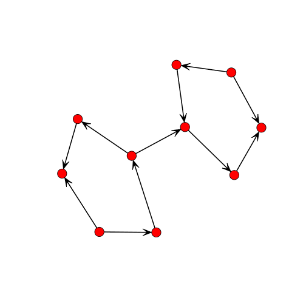
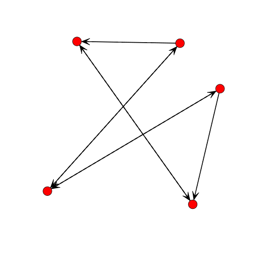
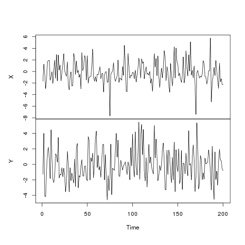

Measuring Causality
========================================================
author: Zarrar Shehzad
date: July 15, 2014


========================================================

## How can causal models help?

- understand the direction of information flow in a brain network
- better test psychological models with the brain data

## Application

- Biographical faces task
- ATL -> FFA with learning?


Want to learn more about Causal Models?
========================================================

See _'Bayesian networks for fMRI: a primer'_ from Mumford & Ramsey (2014).

- Note: no traditional SEM or DCM
- Describes bayesian networks generally
- Methods from Smith et al (2011)
- Advances since the 2011 paper


Example Causal Network
========================================================

This is a simulated network from a sample subject taken from Steve Smith et al. (2011).

 


Six+ Issues for Causal Inference
========================================================

Adapted from Ramsey et al. (2010).

1. Searching over models
2. Indirect measurements
3. Modeling causal structure across individuals
4. Distinct but overlapping variable sets
5. Varying delays in BOLD response
6. Equilibrium or time-series
7. Backward (recurrent) connections


Issues with recurrent networks
========================================================

One issue is that connections can be bi-directional due to recurrent information processing.

 


What are some options?
========================================================

1. 1dSVAR 
  - *#sem #granger #gaussian #task #group*
2. LOFS
  - *#baysesian #non-gaussian*
3. Pairwise LiNGAM + Inverse Covariance
  - *#bayesian #non-gaussian #fast*
4. Non-Gaussian SVAR 
  - *#sem #granger #bayesian #non-gaussian*
5. GIMME 
  - *#sem #granger #gaussian #task #group*


Super Brief Background on the Methods
========================================================

1. SEM or usually Path Analysis
  - which A->B or B<-A explains more variability?
2. Granger
  - auto-regressive
  - thought not to work given variability in BOLD
3. Non-Gaussian
  - these are actually like SEM 
  - but use Non-Gaussian distributions
  - careful with the high-pass filter
  

Super Brief Background on the Methods
========================================================

4. Group
  - some methods can combine across individuals (no no to concatenation)
  - some methods (GIMME) use group map as prior on individual maps
5. Deconvolution (not shown previously)
  - deconvolve the BOLD response to get inferred neural response
  - can be beneficial to methods like Granger


SEM or Path Analysis
========================================================

## Imagine Time-Series X->Y

 

Residuals
========================================================


```r
fit <- lm(X ~ Y)
```

What are some options?
========================================================

1. 1dSVAR 
  - *#sem #granger #gaussian #task #group*
2. LOFS
  - *#baysesian #non-gaussian*
3. Pairwise LiNGAM + Inverse Covariance
  - *#bayesian #non-gaussian #fast*
4. Non-Gaussian SVAR 
  - *#sem #granger #bayesian #non-gaussian*
5. GIMME 
  - *#sem #granger #gaussian #task #group*


1dSVAR
========================================================

Structure Equation Modeling (SEM) + Granger Causality

## Advantages

- Easyish to use
- Can model task-based connectivity
- in R so Z can compute

## Disadvantages

- No simulations to compare to other methods
- Maybe computationally intractable?


LOFS
========================================================

Only does orientation of identified edges relying on non-Gaussian assumptions. Has two rules:

### Rule 1

Test the residuals of all possible models associated with adding a single directed edge and choose the solution that has the most non-Gaussian residuals.

### Rule 2

Assume model w/ nodes *rain* & *clouds*. If:

$$NG(rain,clouds) > NG(rain)$$
$$NG(clouds,rain) < NG(clouds)$$

Then *clouds* -> *rain*. Note $NG(rain,clouds)$ is the residual...


LOFS
========================================================

Don't know enought about this to list advantages and disadvantages. It is available in the Tetrad software package.

One good thing is that it can measure 2-cycles. A->B and B->A.


LiNGAM
========================================================

Only does orientation identification and relies on non-Gaussianity too. In a later slide will explain how one may set the connections first. Generally estimates:

$$\frac{1}{T} \log{L(X \to Y)} - \frac{1}{T} \log{L(Y \to X)}$$

- When positive: $X \to Y$.
- When negative: $Y \to X$.

The likelihood difference is approximated as

$$pE{\{g(X)Y - Xg(Y)\}}$$

There are 5 possible log-likelihood functions.


LiNGAM
========================================================

## Advantages

* Code is super easy (<100 lines).
* Is in matlab and now in R (me).
* Did well in Smith et al (2014) simulations.

## Disadvantages

* This particular implementation is only pairwise
* Hidden variables not accounted for?
* Feedback connections not accounted for


Selecting Your Connections
========================================================

Can use of the following approaches that all test conditional independence:

- Sparse inverse covariance matrix (e.g., graphical lasso or L1 norm)
- Peter and Clark (PC) algorithm
- Greedy Equivalence Search (GES)

These all did very well in Smith et al. (2011) in detecting an undirected connection. Such selection is needed for LOFs and pairwise LiNGAM.


Non-Gaussian SVAR
========================================================

Similar to 1dSVAR but this approach assumes non-gaussianity (Hyvarinen et al., 2010).

1. Estimate a classical autoregressive model for the data
2. Compute the residuals
3. Perform LiNGAM on the residuals
4. Combine #1 and #3 estimates together.


GIMME
========================================================

Group Iterative Multiple Model Estimation (GIMME) is an SEM + Granger approach (Gates and Molenaar, 2012).

- "in the GIMME algorithm, the lagged effects help improve the estimation of the contemporaneous effects"
- can include task modulation in model as well
- don't seem to have publically available code


GIMME - Group Steps
========================================================

1. Starting with a completely empty graph, each possible connection has a score defined by the proportion of subjects whose graphs are significantly improved by adding that edge.
2. P-values are determined by the subject-wise modification index (MI) (Sörbom, 1989). 
3. The connection with the highest score, exceeding a minimum threshold (say, 77% of the subjects or higher) is added.
4. Continue until no edge has a score above threshold, 
5. then re-score edges and remove in a backward fashion to obtain the group graph.


GIMME - Subject Steps
========================================================

1. The group map is used as a starting point for each individual subject's map.
2. In a forward fashion, within-subject, the most significant connections are added 
3. and then, after no further significant connections can be added, a backward selection procedure is used to eliminate insignificant connections.


Results
========================================================

Show some results from the Ramsey et al. (2014) paper that uses:

- Smith et al. (2011) simulations
- More complex graphs
- A real-world graph


Results: Non-Gaussian + Filtering
========================================================

See benefit of unfiltered single subject data (or at least being careful with filter):


Results: Non-Gaussian + Filtering
========================================================

Same but with group average data


Results: More complex model
========================================================

Using unfiltered data from two complex graphs:

1.  2. 


Results: More complex model
========================================================

Findings are good for #1 but not really great for #2 with backward connections.


Results: Real world example
========================================================

Used data from Xue & Poldrack (2007):


Final Thoughts
========================================================

- All of the discussed methods do very well on the Smith et al. (2014) simulations
- Potentially feasible to obtain reasonable causal connectivity estimates
- How shall we proceed?
