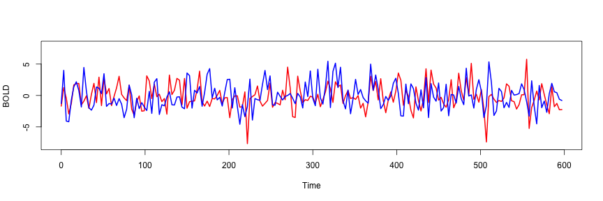
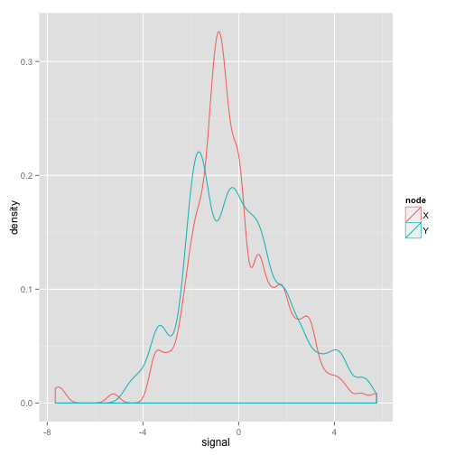
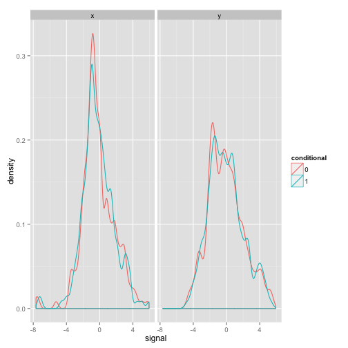

Testing Causality
========================================================
author: Zarrar Shehzad
date: 2014-07-16

Imagine the following connected nodes
========================================================

- X = red
- Y = blue

 

Let's try to see the distribution of each
========================================================


```r
library(ggplot2)
library(reshape)
df <- melt(xy)
colnames(df) <- c("tpts", "node", "signal")
ggplot(df, aes(x=signal, color=node, group=node)) + 
#  geom_freqpoly(aes(y=..density..), binwidth=0.5, linetype=2) + 
  geom_density(adjust=0.5)
```

 


Let's see the effect of regressing y|x and x|y
========================================================


```r
fity.x <- lm(Y ~ X, data=as.data.frame(xy))
fitx.y <- lm(X ~ Y, data=as.data.frame(xy))
y.x <- fity.x$residuals + mean(xy[,2])
x.y <- fitx.y$residuals + mean(xy[,1])
xy2 <- cbind(x.0=xy[,1], y.0=xy[,2], x.1=x.y, y.1=y.x)
```


Let's see the effect of regressing y|x and x|y
========================================================


```r
df <- melt(xy2)
colnames(df) <- c("tpts", "node.conditional", "signal")
tmp <- strsplit(as.character(df$node.conditional), "[.]")
df$node <- sapply(tmp, function(x) x[1])
df$conditional <- sapply(tmp, function(x) x[2])
```

Let's see the effect of regressing x|y and y|x
========================================================


```r
ggplot(df, aes(x=signal, color=conditional)) + 
  geom_density(adjust=0.5) + 
  facet_grid(~node)
```

 

Variance
========================================================


```r
res <- ddply(df, .(node.conditional), colwise(var, .(signal)))
msg <- paste("x   = %.2f", "x|y = %.2f", "y   = %.2f", "y|x = %.2f", sep="\n")
sig <- res$signal
cat(sprintf(msg, sig[1], sig[2], sig[3], sig[4]))
```

```
x   = 3.81
x|y = 3.63
y   = 4.51
y|x = 4.29
```

Difference in Variance
========================================================

It appears that $x$  has more of an influence on $y$.


```r
res <- ddply(df, .(node.conditional), colwise(var, .(signal)))
msg <- paste("x - x|y = %.2f", "y - y|x = %.2f", sep="\n")
sig <- res$signal
cat(sprintf(msg, sig[1] - sig[2], sig[3] - sig[4]))
```

```
x - x|y = 0.18
y - y|x = 0.21
```


Other Moments
========================================================

We can also look at skewness and variance.


```r
library(moments)
round(skewness(xy2), 4)
```

```
    x.0     y.0     x.1     y.1 
-0.0126  0.4060 -0.0033  0.3792 
```

```r
round(kurtosis(xy2), 4)
```

```
  x.0   y.0   x.1   y.1 
4.600 2.797 4.484 2.725 
```


Probabilities
========================================================


```
Error in eval(expr, envir, enclos) : could not find function "freq2d"
```
